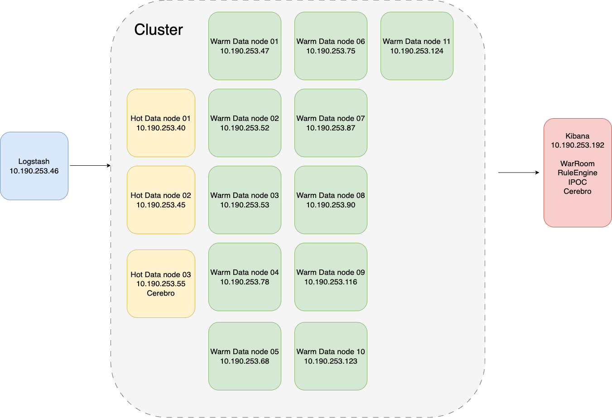

# Walsin ELK Log Analysis System

## 📖 Project Overview
This project represents a comprehensive centralized logging and monitoring solution built on the **ELK Stack (Elasticsearch, Logstash, Kibana)**. It was designed to ingest, normalize, and visualize logs from a wide array of network security devices and servers, providing the Security Operations Center (SOC) with real-time visibility into the organization's security posture.

## 🏗 Architecture

*(Detailed topology view)*

The system aggregates logs from:
*   **Security Appliances:** Fortinet, Cisco ASA, Citrix, WAF.
*   **Infrastructure:** Active Directory (Identity), Windows Servers, MSSQL.

Data flows through:
1.  **Ingestion (Logstash):** Complex pipelines normalize raw logs into structured JSON.
2.  **Storage (Elasticsearch):** Optimized indices with ILM (Index Lifecycle Management) and sharding strategies.
3.  **Visualization (Kibana):** Custom dashboards for threat hunting and traffic analysis.

## 🔧 Key Technologies & DevOps Practices

### 1. Infrastructure as Code (Configuration Management)
*   **Logstash Pipelines:** Configuration files (`03-logstash正規化設定/config/*.conf`) act as the source of truth for data parsing logic. Complex logic (e.g., handling changing log formats) is versioned.
*   **Dashboard Objects:** Kibana objects are exported as `.ndjson` for backup and portability (`04-kibana儀表板`).

### 2. System Reliability & Performance
*   **Stress Testing:** Rigorous CPU and Disk I/O benchmarking (`07-維護管理/壓測紀錄`) ensures the cluster can handle peak ingestion rates.
*   **Capacity Planning:** Storage benchmarks (Read/Write speeds) guide hardware provisioning.
*   **Maintenance Automation:** Scripts for housekeeping, snapshotting, and reindexing (`08-相關服務`) reduce toil.

### 3. Observability & Monitoring
The system provides deep insights through specialized dashboards:
*   **Threat Monitoring:** Visualizing blocked connections, virus detections, and intrusion attempts.
*   **Traffic Analysis:** Bandwidth usage, top talkers, and geographic distribution.
*   **Identity Management:** Tracking failed logins and privilege escalation attempts.

## 📂 Directory Structure Highlights

*   `03-logstash正規化設定/`: **Pipeline Configurations**. Shows how different log sources (Cisco, Forti, etc.) are parsed.
*   `04-kibana儀表板/`: **Visualization Code**. Exported dashboard definitions and screenshots of the UI.
*   `07-維護管理/`: **Operations Documentation**. Includes stress test reports, upgrade plans, and maintenance logs.
*   `08-相關服務/`: **SOPs & Scripts**. Guides for disk mounting, snapshot management, and shard optimization.
