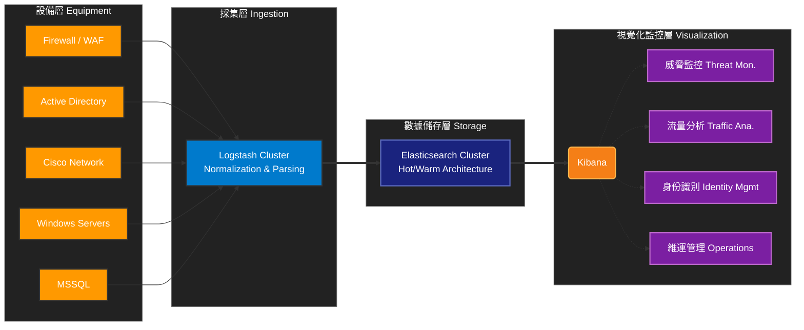

```mermaid
graph LR
    %% Subgraphs for Layers
    subgraph Equipment [設備層 Equipment]
        direction TB
        FW[Firewall / WAF]:::orange
        AD[Active Directory]:::orange
        Cisco[Cisco Network]:::orange
        Win[Windows Servers]:::orange
        DB_Src[MSSQL]:::orange
    end

    subgraph Ingestion [採集層 Ingestion]
        direction TB
        Logstash[Logstash Cluster<br/>Normalization & Parsing]:::blue
    end

    subgraph Storage [數據儲存層 Storage]
        direction TB
        ES[Elasticsearch Cluster<br/>Hot/Warm Architecture]:::darkblue
    end

    subgraph Visualization [視覺化監控層 Visualization]
        direction TB
        Kibana(Kibana):::grafana
        D1[威脅監控 Threat Mon.]:::purple
        D2[流量分析 Traffic Ana.]:::purple
        D3[身份識別 Identity Mgmt]:::purple
        D4[維運管理 Operations]:::purple
    end

    %% Connections
    FW --> Logstash
    AD --> Logstash
    Cisco --> Logstash
    Win --> Logstash
    DB_Src --> Logstash

    Logstash ==> ES

    ES ==> Kibana

    Kibana -.-> D1
    Kibana -.-> D2
    Kibana -.-> D3
    Kibana -.-> D4

    %% Styling Classes with Standard CSS
    classDef orange fill:#ff9900,stroke:#333,stroke-width:2px,color:white;
    classDef blue fill:#007acc,stroke:#333,stroke-width:2px,color:white;
    classDef darkblue fill:#1a237e,stroke:#5c6bc0,stroke-width:2px,color:white;
    classDef purple fill:#7b1fa2,stroke:#ba68c8,stroke-width:2px,color:white;
    classDef grafana fill:#f57f17,stroke:#ffb74d,stroke-width:2px,color:white;

    %% Background Styling for Dark Theme Emulation
    style Equipment fill:#222,stroke:#666,color:#fff
    style Ingestion fill:#222,stroke:#666,color:#fff
    style Storage fill:#222,stroke:#666,color:#fff
    style Visualization fill:#222,stroke:#666,color:#fff
```
