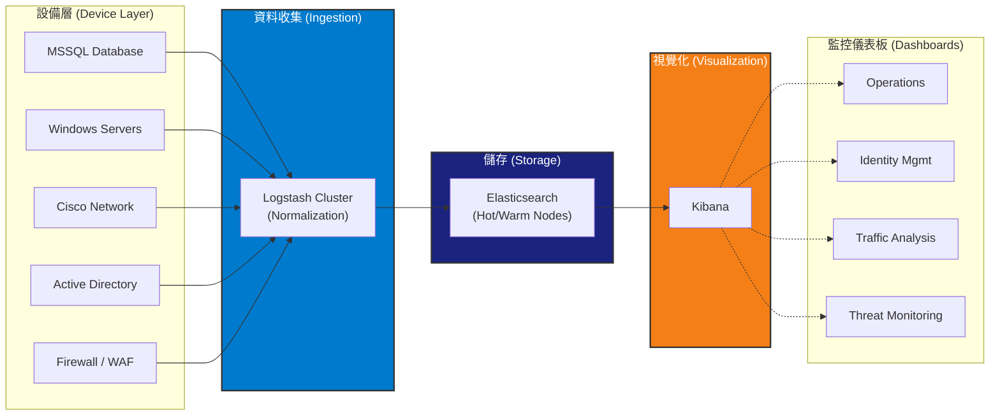

# [你的姓名]
## 數據工程師 (Data Engineer) | 目標職位：DevOps 工程師
[Email] | [LinkedIn] | [GitHub] | [作品集連結]

---

## 🚀 專業摘要 (Professional Summary)
擁有 5 年以上經驗的數據工程師，專精於建構可擴展的資料管道與監控基礎設施。核心專長為 **ELK Stack (Elasticsearch, Logstash, Kibana)** 的企業級日誌分析與資安監控。熟練掌握 **Golang, MySQL, Docker 與 Linux**，並具備優化系統效能、自動化維運與高可靠性架構的實務經驗。目前正積極轉型為 **DevOps 工程師**，致力於將可觀測性 (Observability)、基礎設施維護與 CI/CD 實踐應用於現代化開發流程。

---

## 🛠 技術技能 (Skills)

*   **DevOps & Cloud:** Docker, Linux (系統管理、效能調校), ELK Stack (叢集管理、索引優化), CI/CD 概念。
*   **程式語言:** Golang, Python, Shell Scripting.
*   **資料庫:** MySQL, Elasticsearch (Index Lifecycle Management, 分片策略).
*   **監控與工具:** Kibana, Logstash, Git.

---

## 💼 工作經歷 (Professional Experience)

### **數據工程師** | [目前公司名稱]
*日期 (例如: 2019 - 至今)*

*   **集中式日誌管理平台 (Centralized Log Management Platform - ELK Stack):**
    *   設計並維護高可用性 (High-Availability) 的 ELK 叢集，負責接收並分析每日約 **800~850 GB** 的日誌數據，來源涵蓋多種網路設備 (Firewalls, WAF, AD, Cisco)。
    *   開發複雜的 **Logstash Pipelines**，運用 Grok patterns 與 Ruby filters 將非結構化數據標準化，確保來自 **10 種不同日誌類型 (涵蓋數十台設備)** 的資料一致性。
    *   從零開始建構資安可觀測性平台，針對不同日誌類型開發 **7 套專屬 Kibana 儀表板**，為 SOC (資安維運中心) 團隊提供即時的威脅監控與流量分析能力。
    *   實作索引生命週期管理 (ILM) 與快照策略 (Snapshot Strategies) 以因應災難復原需求，確保資料可用性達 **99.9%**。
    *   執行系統壓力測試與容量規劃 (Capacity Planning)，優化 CPU 與 Disk I/O 使用率以應對流量高峰。
    *   透過 Shell Scripts 與 Cron Jobs 自動化日常維護任務 (如清理、Reindexing)，大幅降低手動維運成本。

*   **[專案名稱 2 - 待補充]:**
    *   (待填寫)

---

## 📂 專案經驗 (Projects)

### **華新麗華 ELK 日誌分析系統**
*企業級日誌聚合與視覺化平台*

*   **基礎設施 (Infrastructure):** 在 Linux 伺服器上部署並調校 Elasticsearch 節點；優化 JVM Heap 與 Shard 分配以提升效能。
*   **Pipeline as Code:** 將 Logstash 設定檔視為程式碼管理，以靈活應對各類資安設備日誌格式的頻繁變更。
*   **可觀測性 (Observability):** 建立全方位的監控儀表板，即時監控網路流量、使用者身分識別與資安威脅。
*   **維運管理 (Maintenance):** 建立標準作業程序 (SOP)，涵蓋系統升級、壓力測試與災難復原演練。
